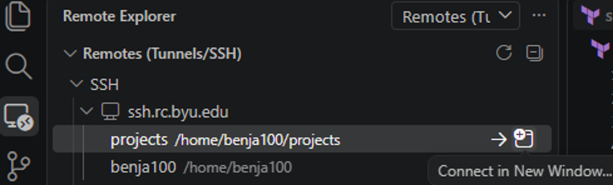
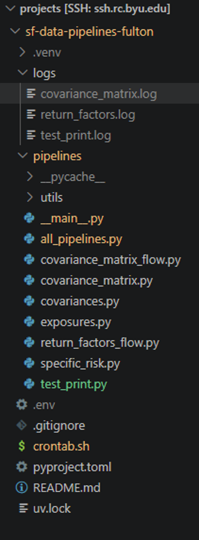

# sf-data-pipelines-fulton
Data pipelines built by the Silver Fund Developer team that run on the Fulton Supercomputer.

# How to Use the Fulton Supercomputer

Silver Fund has cron jobs running on the Fulton Supercomputer. We use this to pull sensitive financial Barra data from the supercomputer filesystem and upload it to AWS S3 for use by the Silver Fund data pipelines and web services. All data pulled from the supercomputer is sensitive and must remain protected behind authentication.

We currently do not have a shared Silver Fund account; instead, individual student accounts run the cron jobs.

In order to get an account on the Fulton, visit [https://rc.byu.edu/](https://rc.byu.edu/) and request an account. Request Brian as your supervisor (requires approval from him and Research Computing). You will also need to configure MFA (with an authenticator app) to allow SSH.

## How to Remote into the Fulton

Connecting to your login node on the Fulton:

1. Use the VS Code Remote Explorer extension.
2. Hit **Connect in New Window...**



3. Enter your password.


4. Enter your MFA code from your authentication app.


Once logged in, you should be in your home directory `/home/{username}/`.

Clone the repository into a `projects` folder:

```bash
mkdir -p ~/projects
cd ~/projects
git clone https://github.com/BYUSilverFund/sf-data-pipelines-fulton.git
cd sf-data-pipelines-fulton
```


## Environment Configuration

Copy `example.env` to `.env` and fill in the required variables:

```bash
cp example.env .env
```

Refer to [`example.env`](example.env) for full variable descriptions (`PROJECT_PATH`, `DATA_ROOT`, and AWS S3 credentials).

## Dependency Installation

Set up a virtual environment and install dependencies using **`uv`** (recommended) or **`pip`**:

### Using `uv` (Recommended)
```bash
uv sync
```

### Using standard `pip`
```bash
python3 -m venv .venv
source .venv/bin/activate
pip install -e .
```

## Running Pipelines Manually

Activate your virtual environment and run the CLI:

```bash
source .venv/bin/activate

# Run covariance matrix pipeline
python -m pipelines covariance-matrix

# Run return factors pipeline
python -m pipelines return-factors

# Run historical data pipeline (defaults to yesterday)
python -m pipelines historical-data

# Backfill historical data from a specific date
python -m pipelines historical-data --since 2024-01-01
```


## Pipelines Overview

All pipeline CLI commands are defined in [`pipelines/__main__.py`](pipelines/__main__.py):

1. **`historical_data` (`historical-data`)**
   - **Input**: Daily Barra returns archives and ticker mappings from `$DATA_ROOT`.
   - **Destination**: S3 bucket `barra-stock-history` (`YYYY/MM/DD.parquet`).
   - **Description**: Pulls historical stock prices and returns joined by ticker. Supports `--since` for backfilling historical corrections.

2. **`covariance_matrix` (`covariance-matrix`)**
   - **Input**: Barra asset exposures, factor covariances, and specific risk data on Fulton for the latest market date.
   - **Destinations**: 
     - S3 bucket `barra-covariance-matrices` (`latest.parquet`): Stock covariance matrix keyed by ticker.
     - S3 bucket `barra-factor-exposures` (`latest.parquet`): Asset factor exposures keyed by ticker.
   - **Description**: Computes the multi-factor risk covariance matrix across the portfolio and benchmark universe.

3. **`return_factors` (`return-factors`)**
   - **Input**: Daily Barra SMD factor return files (`USSLOWL_100_DlyFacRet.<date>`) from `$DATA_ROOT`.
   - **Destination**: S3 bucket `barra-factor-returns` (`latest_return_factors.parquet`).
   - **Description**: Extracts and cleans daily return series for all Barra style and industry factors.

## Automated Crontab & Logging

To schedule the pipelines on your Fulton login node, run [`crontab.sh`](crontab.sh):

```bash
chmod +x crontab.sh
./crontab.sh
```


### Schedule & Log Locations

The script registers the following nightly cron jobs (MST):
* **02:00 AM**: `return-factors` $\rightarrow$ `logs/return_factors.log`
* **02:01 AM**: `covariance-matrix` $\rightarrow$ `logs/covariance_matrix.log`
* **02:02 AM**: `historical-data` $\rightarrow$ `logs/historical_data.log`

### Monitoring & Maintenance

* **View running cron jobs**: `crontab -l`
* **Stream live logs**: `tail -f logs/*.log`
* **Important**: **Only one student** should have active cron jobs at any given time to avoid race conditions and redundant S3 overwrites.

Note: We run all our jobs on login node cron jobs, this is not an issue because they are small and don’t need any powerful compute. But just FYI this might need to change in the future.