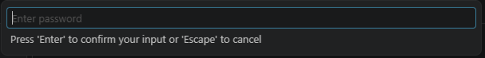
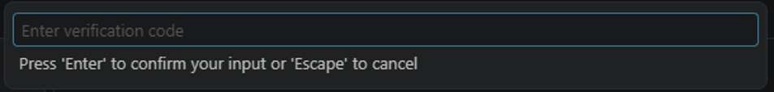
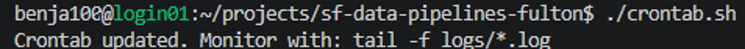
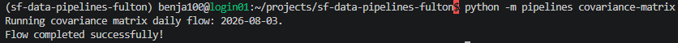

# sf-data-pipelines-fulton
Data pipelines built by the Silver Fund Developer team that run on the Fulton Super Computer.

# How to Use the Fulton Supercomputer

Silver Fund has some cron jobs running on the fulton. We use this to pull financial data from the supercomputer usually to S3 to use in the Silver Fund website. All the data you pull off the supercomputer is sensitive and is required to be put behind a login on the website.

We currently do not have a Silver Fund account, instead we use students individual accounts to run the cron jobs. There is a small amount of overhead transferring these scripts between students as we come and go.

In order to get an account on the Fulton you will need to go to https://rc.byu.edu/ and request an account. You will request Brian as your supervisor and he will have to approve as well as someone from research computing for you to get permission. This might take a couple days.

You will need to set up MFA to get into your account

## How to Remote into the Fulton

My setup for connecting to my login node on the Fulton:

1. I use the VS code Remote Explorer extension.
2. Hit connect in new window …

3. Enter your password

4. Then enter your MFA code from your authentication app


Once you have logged in you should be at a filepath like `/home/{username}/`

I created a folder called `/projects`, and cloned the `sf-data-pipelines-fulton` repo:

```bash
mkdir projects
cd projects
git clone [https://github.com/BYUSilverFund/sf-data-pipelines-fulton.git](https://github.com/BYUSilverFund/sf-data-pipelines-fulton.git)
```


Once you have the repo on your login node create an  .env file and set the env vars.

Make the crontab.sh script executable and run it. This will add all of the jobs to your crontab.
Note: Only one student needs to have the jobs running on their crontab. I have a feeling we might get race condition issues if we have multiple people running identical cronjobs. 

```bash
chmod +x crontab.sh
./crontab.sh
```


To run a pipeline you will need all of your env vars set. Activate your venv and run specific pipelines manually (this command runs the covariance matrix pipeline). All pipelines are defined in __main__.py

```bash
source .venv/bin/activate
python -m pipelines covariance-matrix
```



Note: We run all our jobs on login node cron jobs, this is not an issue because they are small and don’t need any powerful compute. But just FYI this might need to change in the future.

## Stock History Pipeline

It will run once daily and pull the historical data from yesterday.
It can also be manually ran with the --since parameter to backfill data. From my understanding sometime barra corrects previous data and this might be useful if we find any data discrepancies in the future.
